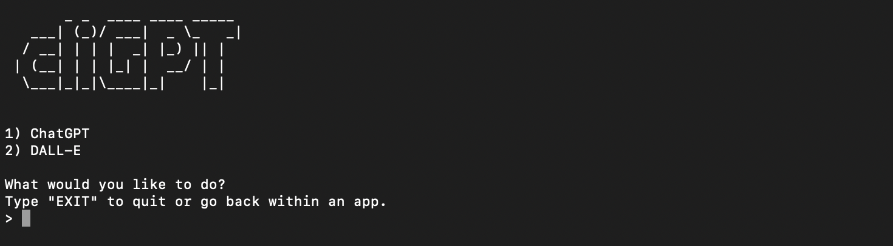
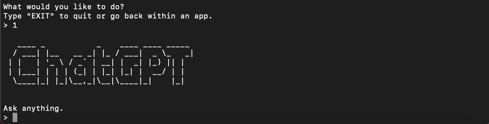
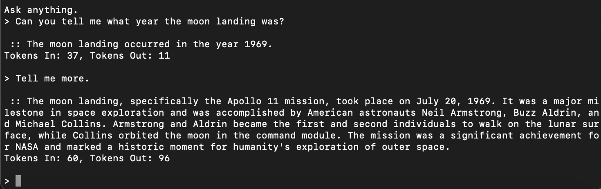
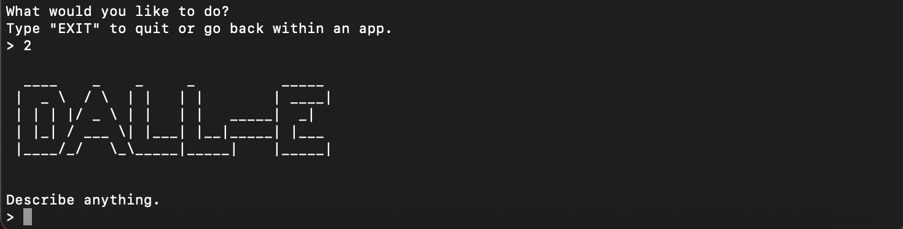
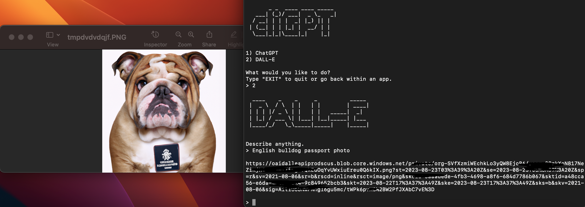

# cliGPT

```
       _ _  ____ ____ _____ 
   ___| (_)/ ___|  _ \_   _|
  / __| | | |  _| |_) || |  
 | (__| | | |_| |  __/ | |  
  \___|_|_|\____|_|    |_|  

``` 
#### <sub> Python command line tool to use ChatGPT and DALL-E.

## <sub> What is it?

* Another command line tool for the OpenAI [API Documentation](https://platform.openai.com/docs/introduction).
* Choose between ChatGPT or DALL-E.



## <sub> ChatGPT

<br>

* Talk to "gpt-3.5-turbo" model by default.
* Utilize ChatGPT like you would in the browser.
* Pass in -m "<MODEL_NAME>" to use an alternative model.
  * See the OpenAI [models overview](https://platform.openai.com/docs/models/overview).

## <sub> DALL-E

<br>

* Describe an image and it will be saved to a file (PNG) and automatically opened.
* 1 Image is generated at a time and the default size is 512x512px.
  * Pass in -s <small/medium/large> to change the size of the generated images.
  * small = 256x256px.
  * medium = 512x512px.
  * large = 1024x1024px.

## <sub> How to install.

* Install the latest version of [Python 3](https://www.python.org/downloads).
* Install the OpenAI [Python package](https://pypi.org/project/openai).
* Clone the repo.

## <sub> How to use.

* Add your OpenAI API key to <b>config.ini</b>.
* python3 cliGPT.py
  * Run default application. Access ChatGPT and DALL-E.
* python3 cliGPT.py -h
  * Display help message.
* python3 cliGPT.py -m "gpt-4" -s "large"
  * Use model "gpt-4" and output images as 1024x1024px PNG.
